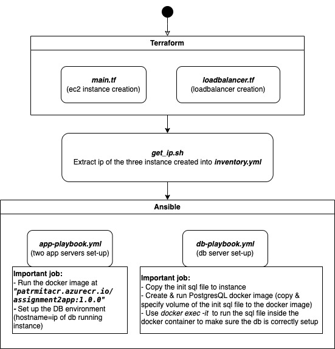
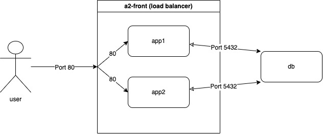
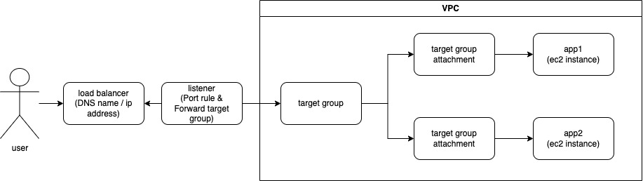

## Overall Set-Up
- Set-up flow chart:


Here is a overall set up flow chart that represent the step of how application is auto deploy. The step is same as in the _set_up.sh_.
By running _set_up.sh_ the steps of deployment will be automatically proceed.
- There are in total three ec2 instance be set-up, two of them are for the app front-end server, one of them is for the. db server instance. Both the app and db server takes the approach of running the docker image on the instances to host the servers.
- In the bash script _set_up.sh_, _ yes yes | _  is used to enter yes when running terraform for the yes/no question; _export ANSIBLE_HOST_KEY_CHECKING=False_ avoids the yes/no question to a new fingerprint host.


## Creation & set-up of servers (Terraform)
The creation and set-up of servers rules are done by terraform.
All the terraform set-up code is in the dirctory in ~/misc/infra. 
With in the ~/misc/infra, use the command to run all tf file to set up all the servers:
```
terraform init
terraform apply
```
#### Terraform backend
The relative set up is done in _state-bucket-infra.tf_ where we create the s3 bucket and use it as a backend state. By _terraform init_,  it automatically get the state in s3 bucket which was spcifify. 

#### Creation of instance
I use terraform to deploy three ec2 instance on AWS. Two of them are for running the app server, one of them are for running the db server. The instraction of creating the three ec2 instance is in _main.tf_ where the names is set up as local variable as vms_app:{app1, app2}, and vms_db:{db}
#### Security group set-up



Above is an simple chart about the connection of a normal process of how accessing the application will be like. Note that this is just a simple illustration of how the generall port would use, it does not explain the detail how loadbalancer works. The illustration of load balancer will be explain at the section below

For the inbound rules, SSH (22) , HTTP (80) , PostgreSQL (5432) are opened. 
For the output rules HTTPS (443), PostgreSQL (5432) are opened.
SSH is for when managing the two types of instance, 
HTTP is for accessing from the web to the app instances, 
PostgreSQL inbound rules open is for accessing the db,
Postgre outbound rules is open for app to connect to the db host.

To keep it simple, I only create one security group for the both type of servers. 
#### Load balancer set up



Above is the relation graph of the set up of load balancer.
When user enter the DNS name/ip address of the load blancer (eg. http://a2-front-1509149884.us-east-1.elb.amazonaws.com), the listener of the load balancer will forward to the taget group (ie. a2-front). The taget group have two attachment ec2 instance, so the access is going to be forward to one of the instance.


## Running docker on servers (Ansible)
I use anisble to configure the environment on app and db instances. We first configure the require environment on the instance, and then run the docker image as hosting the app and db.

#### IP address record (inventory.yml)
use _get_ip.sh_ to get the ip address of the two app instance and the db instance as well as the DNS to a2_front, use it as:
```
bash _get_ip.sh
```
In the script, since it is json file, I use _jq -r_ to get the the data I need.
The result will be store in yml format inventory for ansible to use later on as _inventory.yml_

#### APP playbook
The play book is use to configure the environment for runnning the docker image at _patrmitacr.azurecr.io/assignment2app:1.0.0_
When starting up the app, we specify the DB_HOSTNAME to the ip address of db instance's ip address, and port to 5432 for accessing the postgreSQL port.

#### DB playbook
The play book is use to configure the environment for runnning the docker image for _postgres:14.7_
Before run the postgre docker, we copy the init sql file to the ec2 instance at _/tmp/snapshot-prod-data.sql_, so when start the postgre docker, we mount the _/tmp/snapshot-prod-data.sql_ to _/docker-entrypoint-initdb.d/init.sql_, which will be run for initialize the db data.
And finally, to ensure that the init sql is run, we use_ docker exec_ command to run the sql file again in the docker container. 
For the play book, before any operation was done, I clean up the ec2 by remove any existing docker, and any file or directory that has the same name of _/tmp/snapshot-prod-data.sql_ to prevent any error from happenning.


## Github Actions workflows of deployment
The pipeline is called _cd-pipeline.yml_, in overall I meet the requirment of:
- Create a GitHub Actions workflow which deploys the infrastructure and runs the application on it. (10%)
- Ensure that if the infrastructure is already deployed in the environment, then re-running the workflow is a no-op. (10%)
- Make the GitHub Actions workflow run whenever the `main` branch is modified.
For the GitHub Actions REST API, I did not have time to learn and goes too. deep into it.

#### How to prevent re-run of the deployment
I wrote a script called check_deploy.sh to check whether the app is already deploy. Within the script, I use curl to check both the app homepage, and the database page is functioning as it suppose to be, and return true or false with exit code 1 or 0. If the exit code is 1, the pipeline won't continue further to deploy.

#### How deployment is done
1. Install the requirement (awscli, terraform, ansible, docker, python)
2. Credential and key-pair set-up (aws_credential & key-pair to ssh with chmod 400)
3. Terraform: terraform init & terraform apply, and then, use _bash get_ip.sh_ to update the DNS address and ip address
4. Ansible: _export ANSIBLE_HOST_KEY_CHECKING=False_, and then run the playbook of both app and db.

#### How to make it run for only main branch is modified
```
on:
  push:
    branches:
      - main

  pull_request:
    branches:
      - main
```
By the above setting, only when push to main or any PR to the main will trigget the workflow.


